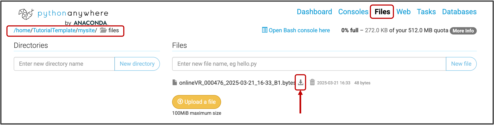

## Decrypting Received Data

Here, we assume that you sucessfully recieved the encrypted data.  After downloading the encrypted data from the server, we need to decrypt it before we can use it for analysis. 
To simplify this process, we provide an implementation in a Python notebook that is complementary to the encryption algorithm provided in the `Encrypt()` function in `ConnectionHandler.cs`. 

You can dowload the Jupyter Notebook here: [GitHub](https://github.com/lkumle/onlineVR-toolbox). 

**1. Download data from PythonAnywhere**
  
To download the data, go the the Filees tab in python anywhere. Navigate to /mysite/files/. The download the recieved data. 

**2. Configure the Jupyter Notebook**  

To decrypt the data, we first need to configure the jupyter notebook. Most importantly, we need to specify the encryption key. That is, the same key we entered within the Bottle_app.py web appplicatuon script. 

To use the decryption script, follow these steps:

1. Provide the **encryption key**. This must be the same values used for encryption. 
2. Specify the **filepath** to the folder containing the encrypted files. You also need to specify the filepath for the folder where you want the decrypted files to be saved.

**2. Decrypt files**  
After configuring the script, simply run Step 3 within the Jupyter Notebook. The decrypted data files will be saved to the path specified in `file_path_out`. 

{: .important-title }
> Check that everything is working 
>
> In case you are replicating the minimal pipeline using the materials provided for this tutorial, the decrypted data file should consist of the folowing message:
> 
> "Well done! You have sucessfully encrypted, transferred, and decrypted a data file."

