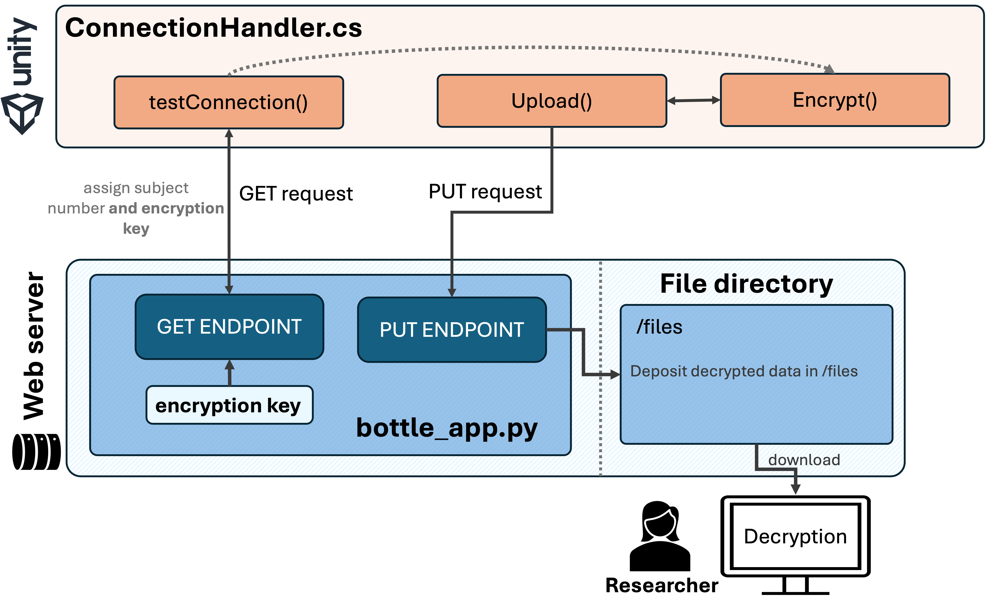

## Encrypting Data in Unity

The easiest way to securely encrypt data within our Unity experiment is by utilizing C#’s built-in AES implementation via the `System.Security.Cryptography` namespace. 
We have implemented AES encryption in the `Encrypt()` function, which is part of the `ConnectionHandler.cs` script. 

{: .highlight}
If you're just replicating the overall pipeline, feel free to test it with the preconfigured encryption key. No need to edit anything – everything should run as is. You can always replace the encryption key with your own keys once you integrate the provided code into your own project!


## Overview
To use the `Encrypt()` function, our Unity experiment needs access the key piece of information: the **encryption key**.   

The encryption key needs to be specified within our web application – this way we ensure that it is not included in any code we publicly share. Have a look at the `encryption_key` variable within the bottle_app.py script. 

The client (i.e., VR task on the participant's computer) then retrieves the encryption key as part of the initial GET request. The `Encrypt()` function then uses the retrieved encryption key to encrypt any data before it is uploaded by the `Upload()` function as part of a PUT request. 





The **Initialisation Vector (IV)** – which is the second critical aspect of AES encryption – is randomly generated by the `Encrypt()` function and transferred as part of the experiment data. The provided decryption function (see [Step 2](https://lkumle.github.io/onlineVRtoolbox_tutorials/docs/encryption/decryption.html)) then automatically retrieves this IV. That is, we don't need to worry about specifyng a IV. However, in case you are interested, see "Details for `Encrypt()`-function" below. 
  

---
___

## Configuring the encryption key

Once you are adapting this pipeline to your own project, you should use your own unique encryption key. To change the encryption key, simply

1. go to your server on pythonanythwere.com and open the bottle_app.py script. 
2. In the configuration section, modify the variables `encryptionKey` by exchanging it with your own key. 

Afterwards, we recommend navigating to the "Web"-tab on Pythonanywhere and clicking "Reload" to make sure the edits are online. 


**How to create an encryption key:**
- The key needs to have a lengths of 16, 24 or 32 bytes
- In our case, we specify the key as a string. The `Encrypt()` function then converts this string into a byte array using UTF-8 encoding. As such, any 16/24/32 character string using ASCII characters will result in a valid encryption key. 

{: .new-title }
> Note on Security
>
> ASCII-based AES keys that are hardcoded in the server backend (i.e., solution implemented in the onlineVR-toolbox) does not correspond the absolute highest possible security standard (i.e., if the server is compromised the key will be available and any data could potentially be decrypted). As a general note, we recommend only transferring and storing deidentified research data through the pipeline provided within the onlineVR-toolbox. Any personal or sensitive data should be collected through reseach specific platforms (e.g., Pavlovia or Quatrics). 

---
--- 

## Details for `Encrypt()`-function

For detais on the `Encrypt()`-function, see below and the `ConnectionHandler.cs` script with in the Unity template (also see Notebook 1 for details on the `ConnectionHandler.cs`). 

```c#
public byte[] Encrypt(byte[] data)
    {
        /// ---------------- 
        // Function Name: Encrypt()
        // Purpose: Encrypts a byte array using AES encryption and returns the encrypted byte array.
        // This function uses a specified encryption key and initialization vector (IV) to perform AES encryption in CBC mode.
        // Parameters: 
        //   byte[] data - The byte array to be encrypted.
        // Return Value: 
        //   byte[] - The encrypted byte array.
        // 
        // Explanation:
        // 1. Creates an AES algorithm instance using Aes.Create().
        // 2. Sets the encryption key and IV using UTF-8 encoding for the provided key and IV strings.
        // 3. Creates an encryptor object using the AES algorithm's key and IV.
        // 4. Uses a MemoryStream to hold the encrypted data and a CryptoStream to perform the encryption.
        // 5. Writes the byte data to the CryptoStream, encrypting it as it’s written.
        // 6. Returns the encrypted byte array after flushing the final block of data.
        // --------

        // Create a new AES algorithm instance
        using (Aes aesAlg = Aes.Create())
        {
            // Set the encryption key and initialization vector (IV) using UTF-8 encoding
            aesAlg.Key = System.Text.Encoding.UTF8.GetBytes(encryptionKey);
            aesAlg.IV = GenerateRandomIV(); // Generate a random IV for each encryption

            // Create an encryptor object using the AES algorithm's key and IV
            ICryptoTransform encryptor = aesAlg.CreateEncryptor(aesAlg.Key, aesAlg.IV);

            // Use a MemoryStream to hold the encrypted data
            using (MemoryStream msEncrypt = new MemoryStream())
            {
                // Create a CryptoStream to perform the encryption
                using (CryptoStream csEncrypt = new CryptoStream(msEncrypt, encryptor, CryptoStreamMode.Write))
                {
                    // Write the byte data to the CryptoStream, which encrypts it
                    csEncrypt.Write(data, 0, data.Length);

                    // Add padding if necessary and flush the final block of encrypted data
                    csEncrypt.FlushFinalBlock();
                }

            // Get the encrypted data from the MemoryStream
            byte[] encryptedData = msEncrypt.ToArray();

            // Prepend the IV to the encrypted data
            byte[] dataForUpload = new byte[aesAlg.IV.Length + encryptedData.Length];
            Buffer.BlockCopy(aesAlg.IV, 0, dataForUpload, 0, aesAlg.IV.Length); // copy IV to new array
            Buffer.BlockCopy(encryptedData, 0, dataForUpload, aesAlg.IV.Length, encryptedData.Length); // add data to new array after IV

            // Return the combined IV and encrypted data
            return dataForUpload;
            }
        }
    }

    // Generate a random initialization vector (IV) for AES encryption
    private byte[] GenerateRandomIV()
    {
        byte[] iv = new byte[16]; // 16 bytes for AES
        using (RNGCryptoServiceProvider rng = new RNGCryptoServiceProvider())
        {
            rng.GetBytes(iv);
        }
        return iv;
    }
```


[Continue with Step 2](https://lkumle.github.io/onlineVRtoolbox_tutorials/docs/encryption/decryption.html){: .btn }