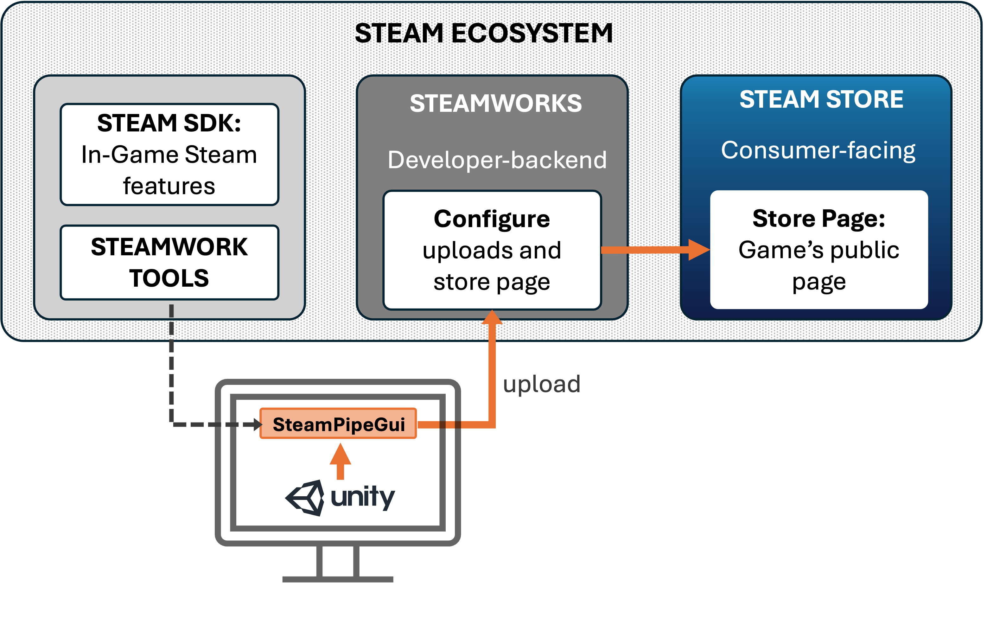

## Uploading the experiment to Steam

On this page, we go over the general steps of uploading an experiment/build to Steam. Instead of detailing every step, we focus on a broader overview and link to detailed resources along the way — we believe these resources explain the process better than we would be able to here. Our hope is that this notebook will provide the necessary context to successfully navigate these additional resources.

### Overview of the Steam Ecosystem

Navigating the Steam ecosystem involves three components, each serving a different role for developers and players:

- **1. Steam Store (Player-Facing Platform)**:  
  The Steam Store is the consumer-facing platform where players (i.e., in our case, participants) find, download, and launch games. Every product on Steam has a public Store Page, which serves as its main entry point.

- **2. Steamworks (Developer Backend)**:  
  Steamworks is the backend portal for developers and publishers. It provides tools for uploading game builds and configuring store pages. This is where developers (i.e., we as researchers) prepare and manage everything that later appears in the Steam Store.

- **3. Steam SDK (In-Game Integration + Tools Bundle)**:  
  The Steam SDK is a software development kit that allows developers to integrate Steam-specific features into their game. Importantly, the SDK download also includes Steamworks tools (e.g.,SteamPipeGUI) which simplify tasks like uploading builds.

{: .highlight}
**Integrating the Steam SDK into your Unity build is *not* required in order to upload the application to Steam.**  
SDK integration is only necessary if we want to use Steam-specific runtime features (e.g., authentication, achievements, or cloud saves), which we do not expect to need for remote VR studies.  
We *do* need to download the Steam SDK because it includes the Steamworks upload tools (like SteamPipeGUI), but using these tools does *not* require integrating any Steam SDK code into the Unity project.

### Getting Started

Below, we summarise the most important steps for getting started with the Steam ecosystem. For a comprehensive overview, see Steam Documentation: [Getting Started](https://partner.steamgames.com/doc/gettingstarted) and [Onboarding](https://partner.steamgames.com/doc/gettingstarted/onboarding).

1. First, we need to [create an account with Steamworks](https://partner.steamgames.com/).  
   This step enables us to access developer features and publish an application on the Steam Store. It includes paying a **$100 fee per application** (i.e., per store page).

2. Second, we need to [download](https://partner.steamgames.com/doc/gettingstarted) the Steam SDK, as this includes the Steamworks tools that simplify the process of uploading our build.

{: .new-title}
> **Timing requirements:**  
>
> Steam imposes two waiting periods on new developers and game releases.  
> - There is a **mandatory 30-day waiting period** between paying the developer fee and releasing your first game (this does *not* apply to subsequent releases/updates).  
> - A new Store Page must be listed as **“coming soon” for at least 14 days**.  
>
> These two waiting periods *can* overlap.  
> Therefore, it is recommended to set up the Store Page early in the development process.

### Configuring the Steam Page

Once you have registered with Steamworks and paid the developer fee, you can begin setting up the game's Store Page. Steam provides a checklist of all tasks required before a Store Page can go live.

In general, Store Pages are designed as landing pages for potential consumers. For commercial game developers, they are a crucial marketing element. For VR remote data collection, however, they serve a more limited purpose since recruitment is not dependent on participants discovering our Store Page.  
Thus, setting up the Store Page mainly serves two purposes:

1. **Complying with Steam’s requirements** so that the game/task can be published.  
2. **Providing accurate information** to both participants and the general public (given that Store Pages are publicly visible).  

- Official guidance: [Steamworks Documentation — Store Presence](https://partner.steamgames.com/doc/store)  
- Example: [Store Page of our Case Study](https://store.steampowered.com/app/2561950/Sort_It/)  
- Step-by-step video tutorial: [Creating a Steam Page](https://www.youtube.com/watch?v=Vwb1HV8KTx8)

Finally, you will need to submit the Store Page for review. Steam administrators may return your submission with comments or required changes before the page can go live. Because of this review process (and the 14-day “coming soon” requirement), we recommend starting the Store Page early.

### Uploading the build

Once you have registered with Steamworks, set up a Store Page, and created a working build of your experiment, the final step is uploading the build to Steam.

We recommend using **SteamPipeGUI**, which is included in the Steamworks Tools within the Steam SDK. This tool greatly simplifies the upload process.  
Small games (below 2 GB) can also be uploaded directly on the Steamworks website as a `.zip` file.

Surprisingly—given that this is central to their platform—the official Steam documentation on build uploading is somewhat outdated and difficult to follow (as of 2025). Fortunately, many developers have created clearer tutorials.

We recommend this step-by-step video tutorial:  
[How to Upload a Game to Steam — Step-by-Step Guide](https://www.youtube.com/watch?v=gwMPvEFFomE)

Many other developers have created similar video tutorials, so searching for these might also be useful.

Additional official documentation:  
[Uploading to Steam](https://partner.steamgames.com/doc/sdk/uploading)
