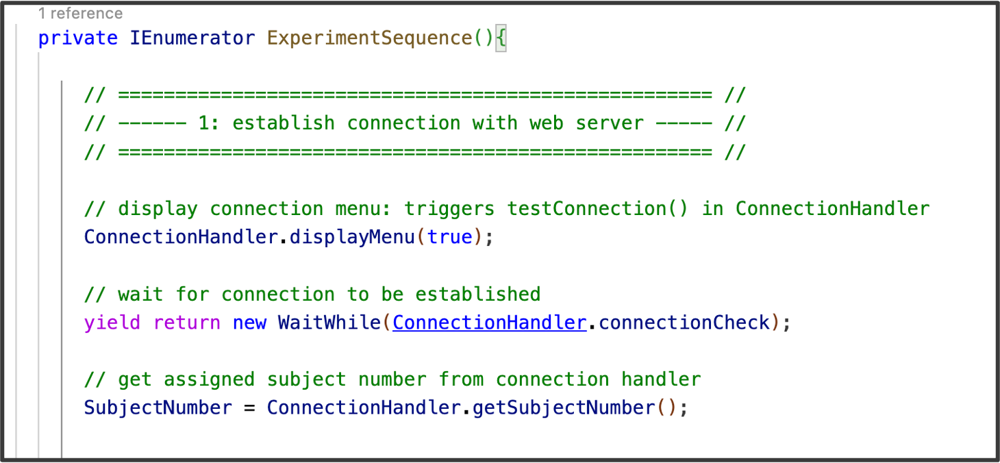

## GET requests:  Establishing connection and retrieving subject ID 

Before participants start the experiment, we want to make sure that a connection with the server is established. This is important to both make sure that the participant has a working internet coonnection so that data can be uploaded once required. Additionally, we want to assign a uniwue subject ID (add why based on main manuscript stuff: link data accross plattforms, distingiguis general public from research participants, ...). 


To implement this, we start the experiment logic with testing the connection. That is, we display the connectionMenu and trigger the testConnection()-function. 




Let's have a look at what the testConnection() function is doing. Feel free to skip this part in case you are simply trying to recreate the pipeline. 

1. Sends a GET request to the server at the provided serverAddress.
- what is a get request? Also see Notebook 2. 
2. Waits for the request to complete.
3. If there's a network/HTTP error, checks retry count (up to 3 attempts) and shows a failure message with the option to retry.
4. If the connection succeeds, logs the response and sets the subjecct number, then removes the connection menu (not needed anymore)

- Status.Text is text object on connectionMenu

```c#
 public IEnumerator testConnection(){
    
        // Initiates a GET request to the specified server address:
        //  - test the connection to an external server: 
        //check if the server is reachable and if it returns a valid response. 
        UnityWebRequest www = UnityWebRequest.Get(serverAddress);
        yield return www.SendWebRequest();

        // IN CASE OF NETWORK ERROR: (network error or an HTTP error during the request)
        if (www.isNetworkError || www.isHttpError)
        {
            // notify participant that conection was not established
            if (retryCount < maxRetry){ // tried connecting less than maxRetry times
                StatusText.SetText("Connection failed. Retrying...");

                // retry connection
                yield return new WaitForSeconds(4);  //wait 4 seconds before retrying
                StartCoroutine(testConnection());
                retryCount += 1;
            }
            else // reached maximal number of retries
            {
                StatusText.SetText("Connection failed. There may be a problem with our servers, try again later.");
            }
        }
         // SUCCESSFUL CONNECTION: -----------
        else
        {
            // 1. Store assigned ID
            // TODO: check what the 37 means??
            queriedID = www.downloadHandler.text.Substring(37);
            
            // 2. signal that connection is established
            connectionOK = true; 

            // 3. disable connection menu
            displayMenu(false); 
        }
    }

```
