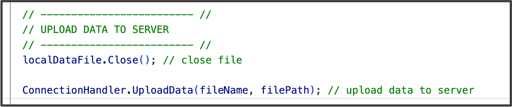

## PUT request: Uploading data to the web application

At the end of each block (or experiment but we recommen block), we need to upload our data. 

For this, we need the other main functionality, which is the Upload Coroutine. 

First, a note on storing data locally before uploading it: The Upload function looks for locally stored data. For that, we need to specify the filename and filepath. For each block, we therefore create a new file. 

A note on filename: to make these unique on the server and avoid writing over existing files, we use the structure:


 
Then, we can trigger the upload routine using the UploadData() helper function. This helper function provides the filename and filepath to the connectionhandler and trigegrs the appropriaze coroutine. 
 




The upload function in detail does the following: Skip if not interested. 

**Explanation:**
1. Retrieves the file name and reads the stored experiment data from the specified file path on participants device.
2. Encrypts the  data.
3. Combines the file name and encrypted data into a single byte array for uploading.
4. Sends a PUT request to the server with the combined data.
5. If there is a network or HTTP error, the function retries the upload (recursive call).


```c#
 IEnumerator Upload()
    {
        // Get filename in bytes
        byte[] filenameBytes = System.Text.Encoding.UTF8.GetBytes(fileName_upload); 
        
        // Read in temporarily stored data and then encrypt 
        byte[] dataBytes = System.IO.File.ReadAllBytes(filePath_upload); // read data from user PC
        byte[] encryptedFileBytes = Encrypt(dataBytes); // encrypt participant data

        // Combine the file name bytes and the encrypted file data into a single byte array
        byte[] uploadData = new byte[filenameBytes.Length + encryptedFileBytes.Length]; 
        System.Buffer.BlockCopy(filenameBytes, 0, uploadData, 0, filenameBytes.Length);
        System.Buffer.BlockCopy(encryptedFileBytes, 0, uploadData, filenameBytes.Length, encryptedFileBytes.Length);
        
        // Create a PUT request with the combined data 
        UnityWebRequest www = UnityWebRequest.Put(serverAddress, uploadData);
        yield return www.SendWebRequest(); // Wait for the upload to complete

         // Handle potential network or HTTP errors
        if (www.isNetworkError || www.isHttpError)
        {
            Debug.Log(www.error);
            StartCoroutine(Upload()); // Retry the upload in case of error
        }
        else
        {
            Debug.Log("Upload complete!"); // Notify that the upload was successful
        }
    }

```


