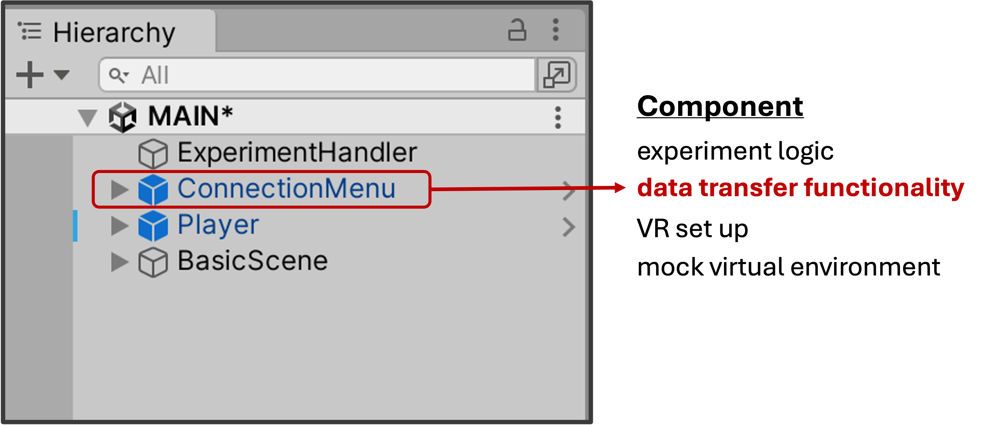
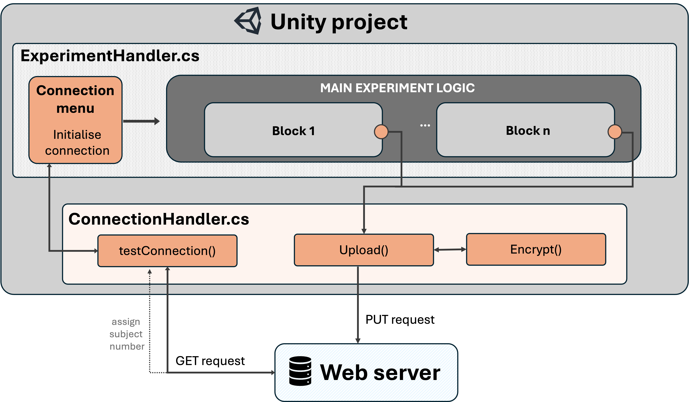

# Notebook 1: Implementing data transfer functionality within Unity 

In this notebook, we will walk through how to implement data transfer functionality inside the unity project itself. 

For this, we created a template Unity project with the minimal required functionality. In this Notebook, we will go through the implementation of the critical fucntionalities within this template project. 

{: .new-title}
> Get started
> 
> To get started, download and open the "onlineTask_template" Unity project within the Unitor Editor.

The goal of this Notebook is to enable you to ultimately integrate the provided implementation into your own Unity project. To do so, we recommend to first replicate the minimal pipeline by following Notebook 1 and 2. Once you are able to send and recieve data from the template Unity task to your web application, you can move on to integrating the provided functionality within your own Unity project. 

--- 
--- 

## Overview of template Unity task

First, we will go through the general pipeline by looking at the Unity template task. This is already set up - so we will just explore. 

Let's first familiarise ourselfs with thie Unity project. Let's start with the hieararchy. 

In this provided template project, two components are important (you can find both in the Hierarchy of the Unity Editor; also see Figure below):
- ExperimentHandler game object (and the attached ExperimentHandler.cs script)
- ConnectionMenu Prefab (and the attached ConnectonHandler.cs script)

Additionally, we added a "basic scene" which is just a empty room as a stand-in for the actual task environment. Lastly, the template task contains a "Player" gameObject, which is part of the SteamVR SDK integration.

{: .highlight}
Replicating the pipeline within the template Unity task does not require the full VR setup. If you want to test this without setting up VR, simply deactivate the Player GameObject (recommended). 

**Experimenthandler.cs** defines the overall experimental logic and sequence. That is, this script handles the sequential logic of defining  blocks, trials etc. 
Here, we created a minimal experimetnal sequence of just two empty blocks (nothing is happening besides creating a small data frame) as a stand in to the actual experimantal logic. We did this to show how the data transfer functionality can and should be integrated into an existing experimental logic. 

ConnectionHandler.cs handles the actual functionality needed to communicate with server (see Fig X highlighted in orange). 

**There are two main functions and stages of this.**
1. Testing connection & assigning subject number once sucessful 
3. Uplaod data at end of each block. 

For all of this, there are two main routines: testconnection() and Upload(). For third main function Encrypt, see Notebook 3. 

Then there are a few helper functions which lets us trigger these routines and embedd tehse in our experiment logic. 

Below, we go into detail how this works. 

