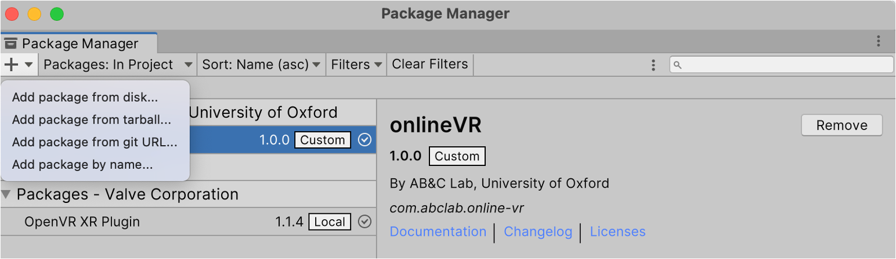

## Integrating onlineVR-toolbox into your Unity task

Now that you have learned how to establish a connection with the web server and upload data, you might wonder how to integrate this functionality into your own Unity task. 


### 1. Install onlineVR package 

1. Download the onlineVR-toolbox package from the [GitHub repository](https://github.com/lkumle/onlineVRtoolbox/releases).
2. Open your Unity project.
3. Go to `Package Manager` > `+` > `Add package from disk`.
4. Select and open the downloaded package json file (../unityPackage/onlineVR/package.json).



### 2. Add ConnectionMenu Prefab

1. In your Unity project, open the scene where you want to integrate the onlineVR-toolbox functionality.
2. In the `Project` window, navigate to the `onlineVR` package folder (path in Editor: `Packages/onlineVR`).
3. Open the /Editor folder and locate the `ConnectionMenu` prefab. This prefab contains the UI elements for the connection menu and is already set up with the necessary scripts.
4. Drag and drop the `ConnectionMenu` prefab into your scene hierarchy.

### 3. Integrate into existing experiment logic

To integrate the onlineVR-toolbox functionality into your existing Unity task, you need to ensure that the `ConnectionHandler.cs` script is called at the appropriate times in your experiment logic. Within the template project, this is done in the `ExperimentHandler.cs` script. You can follow a similar approach in your own project. We detail these steps in Step 1 and 2 of this notebook, where we show how to establish a connection with the web server and upload data.

### 4. Configure with your web application
To configure the onlineVR-toolbox to work with your web application, you need to set the server address in the `ConnectionHandler.cs` script. We go through this in detail in [Notebook 2](https://lkumle.github.io/onlineVRtoolbox_tutorials/docs/webApplication/Index.html), where we show how to set up the web application and configure the server address in the Unity project.


### 5. Some additional notes and tips:

**Invariant Culture Setting**
We recommend setting the current culture to invariant culture in your Unity project. This ensures that data formatting is consistent across different systems and avoids issues with locale-specific formats (e.g., decimal points, date formats). You can do this by adding the following line of code at the start of your main script (also see `ExperimentHandler.cs` in the template project):

```c#
using System.Globalization;

// make sure that culture is set to invariant (for csv writing)
CultureInfo.CurrentCulture = CultureInfo.InvariantCulture;
```

