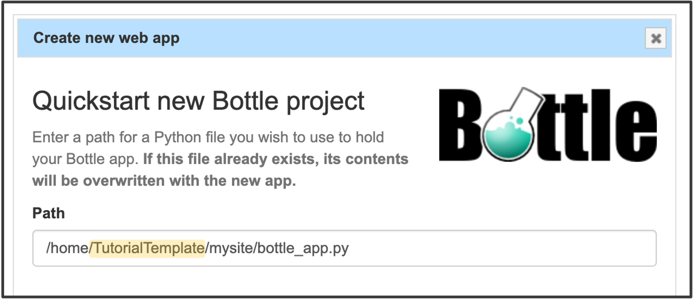

## Step 2: Add basic web application

Next, we need to create and configure a web application on PythonAnywhere. Fortunately, PythonAnywhere provides a straightforward way to deploy and manage web apps with minimal effort.

**1: Add a new web application**
1. Navigate to the "Web" tab in your PythonAnywhere dashboard.
2. Click "+ Add a new web app" to start the setup process.

---
**2: Configure the web application**

If you are using the provided bottle app script, select the following to configure the web application: 
- **python framework:** Bottle

- **python version:** 3.7

Under "Quickstart new Bottle project", do not modify the default path. The path should look like the example below. (*Note:* "TutorialTemplate" is the PythonAnywhere account name used for this tutorial. In your case, it will display your own account name.)

---
**3: Finalizing the Setup**

Once the setup is complete, you will be redirected to a web app configuration page similar to the one below.

- At the top, you will see your web address.
- You will need to use this exact URL in your experiment code (see Step 1: Configure Unity Code).

 

{: .highlight-title }
> Note:
> The web application will run for 3 months and then is automatically disabled.
>
> You will recieve an reminder email before the application is disabled and the web appliucation can be renewed for another 3 months at any time (before and after it has expired).

---
---

[Continue with next step](https://lkumle.github.io/onlineVRtoolbox_tutorials/docs/webApplication/Step3_upload.html){: .btn }