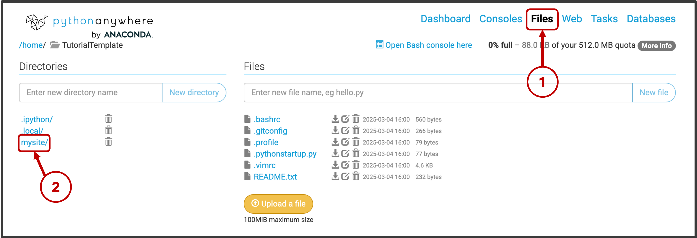
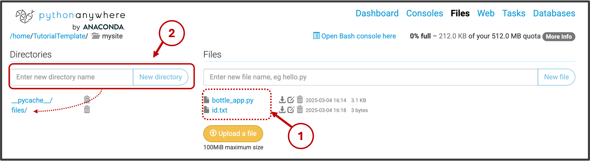

## Step 3: Configure web application

Now that we've deployed a basic web application, the next step is to configure it to provide the required functionality.
  
Let's start with a high-level overview of the setup. Then , we will go through the specifics of configuring the pre-implemented Bottle application on pythonanywhere. 
 
## Overview
We need the web application to respond to the following requests made by our Unity experiments (also see Notebook 1):

- Establish a connection with the Unity experiment following a GET request
- Assign a unique subject number to each participant as part of the GET request
- Receive and store data from the Unity task following a PUT request


**GET endpoint**
The GET method is used to retrieve data on a server. In our case, we are using it to retrieve a subject number as well as a confirmation that the connection is established. To enable this, our Bottle application includes a get endpoint. 

Following a GET request from the testConnection() in our Unity experiment, the web application first retrieves (and increments) a subject number (also see get_next_id() fuction in bottle_app.py script). Then, this subject number is returned within a response message that is returned to testConnection(). 

```python
# =============================================== #
# # Define a GET endpoint to allocate a unique ID
# =============================================== #
@application.get('/')
def welcome():
  """
  Handles GET requests. Allocates a unique ID and returns a response.
  """
  # get updated ID
  allocated_id = get_next_id()
  
  # return response
  # ensures the allocated_id is displayed as a 6-digit number, padded with leading zeros if necessary.
  response_message = f'Connection established. Allocated ID: {allocated_id:06d}'
  return response_message
```

**PUT endpoint**    


The PUT method is used to creates a new resource (e.g., file) on the server with the content included in the request. In our case, we are using it to transfer and store the experiment data. 

Following a PUT request from Upload() within our Unity experiment, our web applications first reads the content (i.e., encrypted data) included in the request, extracts the file name (see [Step 4](https://lkumle.github.io/onlineVRtoolbox_tutorials/docs/webApplication/Step4_fileNames.html)) and writes the retrieved data to the specified file path. 

```python
# =============================================== #
# Define a PUT endpoint to receive and store data
# =============================================== #
@application.put('/')
def save_data():
    """
    Handles PUT requests. Extracts a user ID/file name from the request body and saves the
    remaining data into a file named after the user ID.
    """
    content = request.body.read()
    
    # Extract the first 41 bytes as the filenm (assuming UTF-8 encoding)
    filename = content[:filename_length].decode('UTF-8')
    
    # Define the file path for saving data
    file_path = f'./mysite/files/{filename}.bytes'
    
    # Write the remaining content to the file
    with open(file_path, 'wb') as file:
        file.write(content[filename_length:])
    
    return "Upload complete."
```


---
---
## Configure on pythonanywhere
  

**1. Navgate to application files**
1. Navigate to the "files" tab. 
2. Within files, navigate to *mysite/*. 



---
**2. Replace the Default Bottle Script**

Inside the mysite/ directory:
- Open the existing bottle_app.py file.
- Replace its content with the code from the provided bottle_app.py script.
- Save and close the file.

---
**3. Upload Supporting Files and Directories**  

1. Upload the provided ID.txt file to the mysite/ directory (using the "Upload a file" button). 
This file keeps track of assigned subject numbers, allowing the web application to generate unique IDs for each participant.
2. Create a new directory named *files/* inside mysite/. 
This is where the web application will store incoming data. 





Once complete, the mysite/ directory structure should look like the example above.

---
---

[Continue with next step](https://lkumle.github.io/onlineVRtoolbox_tutorials/docs/webApplication/Step4_fileNames.html){: .btn }

