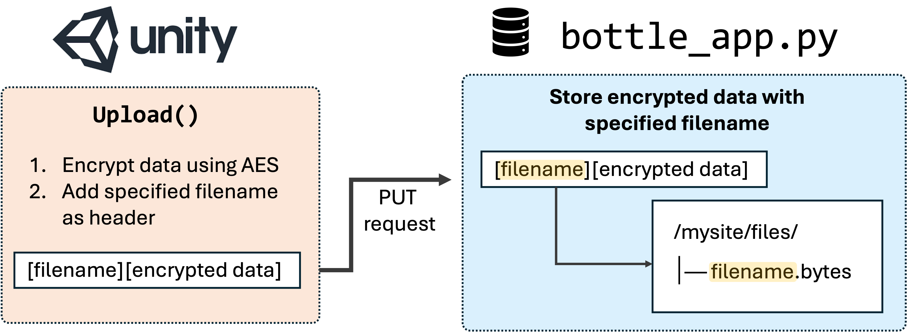

## Step 4: Handling filenames 

If you are simply recreating the provided pipeline, you have now successfully set up your web application! 

However, let’s quickly discuss how filenames are handled and transferred (both by Unity and our Bottle app), so you are able to customise this within your future studies.



**Adding a filename to transferred data**
To forward a filename from Unity to our web application on Pythonanywhere, we can embed the filename within the encrypted data before uploading it. This effectively makes the filename a "header" in the byte stream.

The filename in the provided Unity project is formatted as onlineVR_{subID}_{timestamp}_B{block}, where {subID} is the assigned subject number, {timestamp} represents the time the data files was creates, and {block} codes the block number since we are uploading data afetr every block. 

Within the Upload() function, we simply retrieve the filename specified in ExperimentHandler.cs, and add it to the data that is transferred to our web application. 

---
**How the Bottle App Processes Filenames**

When the Bottle app receives the data:
1. It extracts the filename from the incoming data (the filename itself is not encrypted).
2. It removes the filename from the byte stream.
3. It stores the remaining encrypted data in the */files/* directory.

```python
# =============================================== #
# Define a PUT endpoint to receive and store data
# =============================================== #
@application.put('/')
def save_data():
    """
    Handles PUT requests. Extracts a user ID/file name from the request body and saves the
    remaining data into a file named after the user ID.
    """
    content = request.body.read()
    
    # Extract filename (assuming UTF-8 encoding)
    filename = content[:filename_length].decode('UTF-8')
    
    # Define the file path for saving data
    file_path = f'./mysite/files/{filename}.bytes'
    
    # Write the remaining content to the file
    with open(file_path, 'wb') as file:
        file.write(content[filename_length:])
    
    return "Upload complete."
```

---
## Specify length of filename 

To correctly extract the filename, the Bottle app needs to know its exact length — ensuring it reads only the filename and not any extra data.

To configure this:
1. Open the bottle_app.py script.
2. Locate the configuration section.
3. Adjust the filename_length variable to match the filename size (in bytes).


[Continue with next step](https://lkumle.github.io/onlineVRtoolbox_tutorials/docs/webApplication/Step5_testSetup.html){: .btn }

