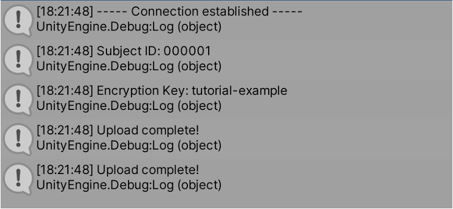
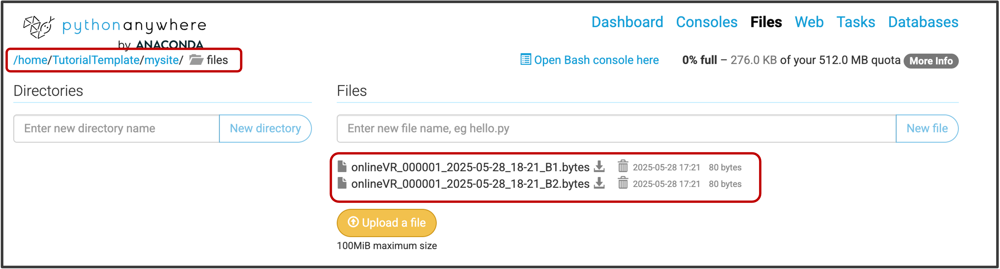
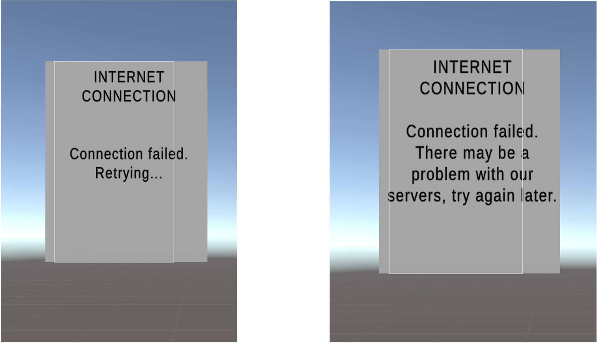

## Finalising and testing data transfer

Let's finalise the setup and test whether everything works as expected. This guide assumes that you have followed the previous steps and have a web application running on PythonAnywhere, and that you are trying to replicate the minimal pipeline from the template project. These steps also apply when integrating the onlineVR-toolbox into your own Unity project.

--- 
### 1. Configure Unity with your web address

1. Open the `ConnectionHandler.cs` script in Unity
2. Find the line where the server address is set (see below)
3. Replace the placeholder address with your actual server address (e.g., `https://yourusername.pythonanywhere.com`).

```csharp

    // ---------------------------------------------------------- //
    // CONFIGURE: 
    // ---------------------------------------------------------- //
    private string serverAddress = "https://TutorialTemplate.eu.pythonanywhere.com";

``` 
---
### 2. Run project in Unity

Run the Unity project within the Editor. As a reminder, the `ExperimentHandler.cs` script runs two `blocks` of the experiment that are empty and do not perform any actions, but it will call the `ConnectionHandler` to upload data files at the end of each block.

If successful, the connection will be established quite quickly, and you will probably not see the menu appear. If you do see the connection menu, it will disappear once the connection is established.

You should also see the following messages in the console:




---
### 3. Check whether data has arrived on the PythonAnywhere server

1. Log in to your PythonAnywhere account.
2. Go to the `Files` tab and open the directory where your data files are stored (for example, `/home/yourusername/mysite/files/`).
3. You should see the uploaded data files (e.g., `onlineVR_000001_2025-05-28_18-21_B1.bytes` and `onlineVR_000001_2025-05-28_18-21_B2.bytes`) in this directory.

{: .highlight}
If the filenames do not match the expected format (for example, if something is missing or extra characters have been added), check `bottle_app.py` and ensure that the filename length is configured correctly (see [Step 4](https://lkumle.github.io/onlineVRtoolbox_tutorials/docs/webApplication/Step4_fileNames.html) for details).




{: .new}
> If you see the files, congratulations!
>
> You have successfully set up the onlineVR-toolbox and replicated the minimal pipeline. To learn how to decrypt the data files, see [Notebook 3](https://lkumle.github.io/onlineVRtoolbox_tutorials/docs/encryption/Index.html).

----
### 4. Double-check that the `Retrying connection` / `No connection` messages work as expected

To test the connection handling, you can temporarily disable your internet connection or open the `ConnectionHandler.cs` script and change the server address to an incorrect value.

This should trigger the connection menu to notify you that it is retrying to connect and then display an error message if the connection cannot be established after three attempts.



----

### Troubleshooting
If you encounter any issues during the setup or testing, here are some common troubleshooting steps:
- **Check the server address**: Ensure that the server address in `ConnectionHandler.cs` is correct and matches your web application URL.
- **Check PythonAnywhere configuration**: Make sure your web application is running and configured correctly on PythonAnywhere. You can check the `Web` tab to see if the application is active.

